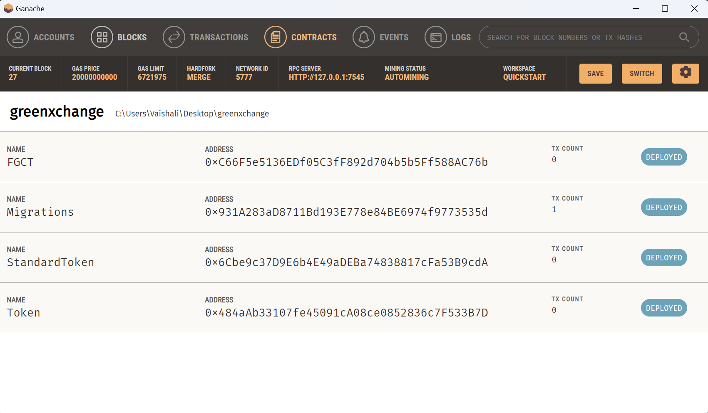

# Setting up project from scratch

- run the following command to initialize truffle react material-ui project
``` 
npx truffle unbox rouftom/truffle-react-material 
``` 
- compiling, testing
```
truffle test
``` 
- deploying
```
truffle develop 

for migrating all the smart contracts again (migration = deployment)
migrate --reset 
```
------

# How to contribute 
- clone 
- checkout to new branch format to be followed- users/${GITHUB_USERNAME}/${FEATURE_NAME_YOU_ARE_WORKING_ON}
- Have truffle suite installed and setup
- Have Ganache installed and setup
- `cd client && npm install` to work on frontend
- `truffle compile` or `truffle migrate` to compile and deploy created smart contracts
- also **do not delete** contracts\Migrations.sol and migrations\1_initial_migration.js files as they are for reference (they are not of any use to GreenXchange).

----

# Deployed Smart Contracts for creating Fungible Green Credit Token (FGCT an ERC20 Token)

## OUTPUT
```Starting migrations...
======================
- Network name:    'ganache'
- Network id:      5777
- Block gas limit: 6721975 (0x6691b7)


2_deploy_FGCT.js
================

   Deploying 'Token'
   -----------------
   - transaction hash:    0xf9a0d00ff8a6289321024716c509b8c9d0f91556fe16e4ff071713167a243a9d
   - Blocks: 0            Seconds: 0
   - contract address:    0x484aAb33107fe45091cA08ce0852836c7F533B7D
   - block number:        24
   - block timestamp:     1731441163
   - account:             0xc5Ca875C9b983F85ba94ae45F3E70c2844D2ba8B
   - balance:             99.993379859163877171
   - gas used:            372152 (0x5adb8)
   - gas price:           2.544198658 gwei
   - value sent:          0 ETH
   - total cost:          0.000946828618972016 ETH


   Deploying 'StandardToken'
   -------------------------
   - transaction hash:    0xa34b6f05be0961b722398e3191e696bd66f1ac3daa0d4d477269edc673e585f8
   - Blocks: 0            Seconds: 0
   - contract address:    0x6Cbe9c37D9E6b4E49aDEBa74838817cFa53B9cdA
   - block number:        25
   - block timestamp:     1731441163
   - account:             0xc5Ca875C9b983F85ba94ae45F3E70c2844D2ba8B
   - balance:             99.992411774313788689
   - gas used:            381243 (0x5d13b)
   - gas price:           2.539285574 gwei
   - value sent:          0 ETH
   - total cost:          0.000968084850088482 ETH


   Deploying 'FGCT'
   ----------------
   - transaction hash:    0xe34cec78fc8dc234cc11023f3d8ccd0c5a8bf15af4a01c7552516f465ad0a7ab
   - Blocks: 0            Seconds: 0
   - contract address:    0xC66F5e5136EDf05C3fF892d704b5b5Ff588AC76b
   - block number:        26
   - block timestamp:     1731441163
   - account:             0xc5Ca875C9b983F85ba94ae45F3E70c2844D2ba8B
   - balance:             99.990909388615671278
   - gas used:            592673 (0x90b21)
   - gas price:           2.534931907 gwei
   - value sent:          0 ETH
   - total cost:          0.001502385698117411 ETH

   - Saving migration to chain.
   - Saving artifacts
   -------------------------------------
   - Total cost:     0.003417299167177909 ETH

Summary
=======
- Total deployments:   3
- Final cost:          0.003417299167177909 ETH
```
## IN A NUTSHELL


Also checkout `client\src\contracts` to view json files containing contract deployment data
